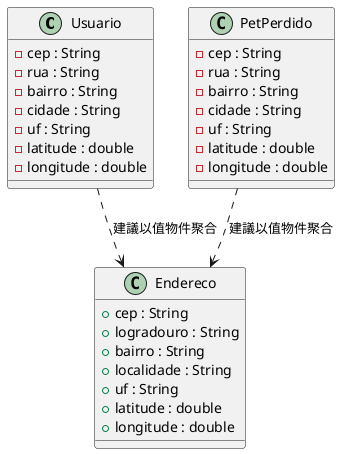
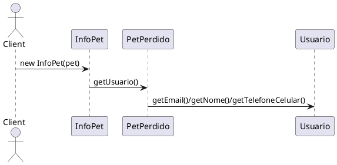
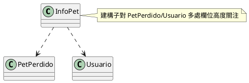
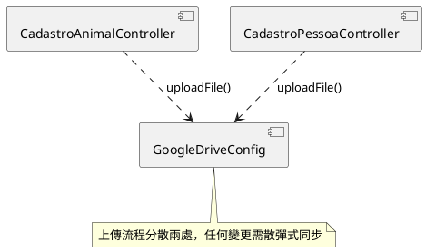

# Code Smells Report (lostpets)

本報告僅依據 `refactor/code_smell.md` 所列之 Code Smells 進行審視與說明；每個條目皆包含：位置、為何是壞味道、缺點影響、建議（含可對照之設計原則）與截圖位置提示（可於 IDE 取圖補上）。

---
## Inconsistent coding standard（不一致的編碼標準）

- 代表位置與現象：
  - 命名語言混用（葡文/英文化），如 `ServiceGeral`, `CadastroPessoaAnimalComponent`, `MensagensAlertas` 等，與英文化 package 混搭。
  - `model/AnimaisAchados.java` 欄位 `@Column(name="LONGIUDE")` 疑似拼字錯誤（應為 `LONGITUDE`）。
  - 直接使用 `System.out.println`/`System.err.println`（`ConverterCSV`, `HistoricoAcessoLog`），混雜於 Spring 專案中（與 Logger 標準不一致）。
- 為何是壞味道：降低可讀性與一致性，增加學習成本；拼字錯誤更可能引發資料庫欄位對應問題。
- 缺點/影響：容易產生誤解與隱性缺陷（特別是 ORM 映射）。
- 建議與原則：
  - 對齊命名規範（英文為主或葡文為主，擇一）；修正拼字；以 Logger 取代 `System.out/err`（KISS, DRY）。
- 截圖建議：
  - [screenshot placeholder] `model/AnimaisAchados.java` 欄位註解處。
  - [screenshot placeholder] `utils/ConverterCSV.java` 例外處理列印處。

### 圖示/程式片段

```java
// model/AnimaisAchados.java（拼字不一致）
@Column(name="LONGIUDE")
private String longitude; // 應為 LONGITUDE
```

```java
// utils/ConverterCSV.java（直接使用 System.err）
} catch (IOException e) {
    System.err.println(e.toString());
}
```

---

## Unresolved warnings（未解決的警告）

- 代表位置：
  - `model/InfoPet.java`：
    - 在建構子前使用 `@SuppressWarnings("deprecation")` 抑制棄用警告。
    - `catch (ParseException e)` 區塊內仍保留自動產生的 `// TODO Auto-generated catch block` 與 `e.printStackTrace()`。
- 為何是壞味道：未處理或被壓抑的警告表示潛在問題被忽略，且 TODO 長期留存會使例外處理策略不清晰。
- 缺點/影響：在不同 JDK/環境可能導致執行期問題；維護者難以判斷應用的錯誤恢復與紀錄策略。
- 建議：
  - 移除不必要的 `@SuppressWarnings`；若必須保留，註解清楚原因與影響範圍。
  - 以明確的錯誤處理（記錄、回傳可解讀訊息、或轉換為應用層例外）取代 `printStackTrace()` 與 TODO。

### 圖示/程式片段

```java
// model/InfoPet.java
@SuppressWarnings("deprecation")
public InfoPet(PetPerdido pet) {
  setAnimalID(pet.getIdAnimal());
  setAnimalName(pet.getNomeAnimal());
  SimpleDateFormat formato = new SimpleDateFormat("yyyy-MM-dd");
  try {
    setLostDate(formato.parse(pet.getDataPerdido()));
  } catch (ParseException e) {
    // TODO Auto-generated catch block
    e.printStackTrace();
  }
  setOwnerEmail(pet.getUsuario().getEmail());
  // ... 其他欄位
}
```

---

## Lack of comments（缺乏註解）

- 代表位置：
  - `service/ViaCep.java`（整體幾乎無註解，含外部 API 參數與回傳結構）
  - `service/PdfRequestService.java`（外部服務 URL 與 payload 缺少說明）
  - `utils/ConverterCSV.java`（檔案讀寫流程、例外處理目的不清）
  - 其他多數 Controller/Service/Model 類別僅有基礎註解或無註解（例如 `AnimaisAchadosService.java`, `PetPerdidoService.java`, `UsuarioService.java`）。
- 為何是壞味道：欠缺「為什麼」的註解，日後維護者難以理解外部 API 契約、錯誤處理策略與業務規則。
- 缺點/影響：提高心智負擔，修改時易誤解需求；異常情況難以追蹤；新成員上手困難。
- 建議與原則：
  - 針對外部 API（URL、授權、回應 JSON 結構）加上概要註解（Design Principles: KISS, Least Knowledge）
  - 關鍵邏輯處加入「為何這樣做」的說明（SRP：將不同責任分拆前，先用註解標出界線）
- 截圖建議：
  - [screenshot placeholder] `project/src/main/java/br/lostpets/project/service/ViaCep.java` 頂部與 `getLatitudeLongitude` 方法內部。
  - [screenshot placeholder] `project/src/main/java/br/lostpets/project/service/PdfRequestService.java` URL 與 `downloadPdf` 方法。

### 圖示/程式片段

```java
// service/ViaCep.java（缺少對外部 API 與金鑰/回應結構的說明）
public Endereco getLatitudeLongitude(String cep) {
  String[] cepV = cep.split("-");
  cep = cepV[0].concat(cepV[1]);
  String URL = "https://geocoder.api.here.com/6.2/geocode.json?searchtext=" + cep
      + "&app_id=YxULymX19IjsS2pE7KGo"
      + "&app_code=6isWeBIxu4YmK1hfYF6s1w"
      + "&gen=9";
  // ... 呼叫並解析 JSON 
}
```

```java
// service/PdfRequestService.java（缺少為何採用此端點與錯誤處理策略的說明）
private static final String URL_REQUEST = "http://localhost:8081/exportpdf";
public String downloadPdf(PetPerdido pet) {
  InfoPet petRequest = new InfoPet(pet);
  Response response = invocationBuilder.post(Entity.entity(petRequest, "application/json;charset=UTF-8"));
  return response.readEntity(String.class);
}
```

---

## Files are checked for existence before attempting to access them（檔案存取前檢查存在性）

- 代表位置：
  - `utils/ConverterCSV.java`：`new File("animaisPerdidos/entrada.xls")`、`new File("animaisPerdidos/saida.txt")` 與 `new FileReader("animaisPerdidos/saida.txt")`，流程中未先檢查檔案是否存在/可讀寫。
  - `utils/HistoricoAcessoLog.java`：`File arquivo` 未先初始化路徑即進入 `FileReader`，`FileNotFoundException` 分支中呼叫 `arquivo.createNewFile()` 時，`arquivo` 仍可能為 null，流程脆弱。
- 為何是壞味道：不檢查存在性會造成例外流程過於依賴 catch；也讓錯誤訊息與恢復策略不明確。
- 缺點/影響：在目錄不存在、權限不足或檔案不存在時，流程容易中斷或出現難以理解的錯誤。
- 建議與原則：
  - 在開檔前以 `File f = new File(path); if (!f.exists()) {...}` 或以 `Files.createDirectories(...)` 建立父目錄；失敗時回傳可診斷的錯誤（KISS, DRY）。
  - 使用 try-with-resources，確保 Reader/Writer 正確關閉（雖不屬於本清單條目，但能降低錯誤）。
- 截圖建議：
  - [screenshot placeholder] `project/src/main/java/br/lostpets/project/utils/ConverterCSV.java` 建構子與 `ImportarAnimais` 方法開頭。
  - [screenshot placeholder] `project/src/main/java/br/lostpets/project/utils/HistoricoAcessoLog.java` `escreverLog` 方法前段。

### 圖示/程式片段

```java
// utils/ConverterCSV.java（未先檢查檔案/目錄存在）
File f = new File("animaisPerdidos/saida.txt");
OutputStream os = (OutputStream) new FileOutputStream(f);
String filename = "animaisPerdidos/entrada.xls";
Workbook w = Workbook.getWorkbook(new File(filename), ws);
```

```java
// utils/HistoricoAcessoLog.java（File 可能尚未設定，且立即用於 FileReader）
arquivo = new File("log/historico_acesso.log");
fileReader = new FileReader(arquivo);
bufferedReader = new BufferedReader(fileReader);
// FileNotFoundException 中再 createNewFile()，流程脆弱
```

---

## Duplicated Code（重複程式碼）

- 代表位置：
  - 影像上傳邏輯於多處 Controller 重覆：
    - `controller/CadastroAnimalController.java` 內：
      ```java
      for (MultipartFile file : files) {
          petPerdido.setPathImg("https://drive.google.com/uc?id=" + GoogleDriveConfig.uploadFile(file));
      }
      ```
    - `controller/CadastroPessoaController.java` 內相似片段（且帶條件 `if(!file.isEmpty())`）。
- 為何是壞味道：當上傳流程或 URL 模式要改時，需要同時在多個地方修改（易產生 Shotgun Surgery 風險）。
- 缺點/影響：維護成本高、易發生行為不一致（例如一處有空檔檢查、另一處沒有）。
- 建議與原則：
  - 以 Extract Method/Extract Class 將「取得公開可讀之 Google Drive 圖片 URL」封裝為單一服務（例如 `ImageStorageService`），Controller 僅呼叫該服務（SRP, DRY, OCP）。
- 截圖建議：
  - [screenshot placeholder] `controller/CadastroAnimalController.java` 上傳迴圈。
  - [screenshot placeholder] `controller/CadastroPessoaController.java` 上傳迴圈。

### 圖示/程式片段

```java
// controller/CadastroAnimalController.java
for (MultipartFile file : files) {
  petPerdido.setPathImg("https://drive.google.com/uc?id=" + GoogleDriveConfig.uploadFile(file));
}
```

```java
// controller/CadastroPessoaController.java
for (MultipartFile file : files) {
  if (!file.isEmpty())
    usuario.setIdImagem("https://drive.google.com/uc?id=" + GoogleDriveConfig.uploadFile(file));
}
```

---

## Data clumps（資料群集）

- 代表位置：
  - `model/Usuario.java` 與 `model/PetPerdido.java` 皆各自持有地址相關欄位：`cep, rua, bairro, cidade, uf, latitude, longitude`。
- 為何是壞味道：多處重覆維護同一組欄位，容易造成欄位不一致與擴充困難（新增地址欄位需在多處同步修改）。
- 缺點/影響：違反 DRY；未來擴充地址結構或加入驗證邏輯時，變更面廣。
- 建議與原則：
  - 依 `code_smell.md` 建議以 Extract Class 將地址聚合為 `Endereco` 值物件，並於 `Usuario`/`PetPerdido` 改為 `Endereco` 欄位（Favor Composition over Inheritance, SRP, OCP）。
  - 目前已有 `model/Endereco.java`，建議在模型中直接使用（而非拆散欄位）。
- 截圖建議：
  - [screenshot placeholder] `model/Usuario.java` 欄位區塊。
  - [screenshot placeholder] `model/PetPerdido.java` 欄位區塊。

### 圖示（PlantUML）



---

## Long parameter list（長參數列表）

- 代表位置：
  - `model/Usuario.java` 的建構子：
    ```java
    Usuario(String nome, String telefoneFixo, String telefoneCelular, String email, String senha,
            String idImagem, String cep, String rua, String bairro, String cidade, String uf,
            double latitude, double longitude)
    ```
  - `model/PetPerdido.java` 的建構子：
    ```java
    PetPerdido(Usuario usuario, String nomeAnimal, String dataPerdido, String descricao,
               String tipoAnimal, String pathImg, String cep, double latitude, double longitude)
    ```
- 為何是壞味道：不易理解與呼叫，容易參數順序出錯；與上節的 Data Clumps 互相映照。
- 缺點/影響：降低可讀性、增加誤用風險（特別是多個同型別字串）。
- 建議與原則：
  - 以 Value Object（例如 `Endereco`、`Contato`）或 Builder pattern 簡化參數列表；（Encapsulate What Varies, KISS）
- 截圖建議：
  - [screenshot placeholder] `model/Usuario.java` 建構子定義。
  - [screenshot placeholder] `model/PetPerdido.java` 建構子定義。

### 圖示/程式片段

```java
// model/Usuario.java
public Usuario(String nome, String telefoneFixo, String telefoneCelular, String email, String senha,
               String idImagem, String cep, String rua, String bairro, String cidade, String uf,
               double latitude, double longitude) { /* ... */ }
```

```java
// model/PetPerdido.java
public PetPerdido(Usuario usuario, String nomeAnimal, String dataPerdido, String descricao,
                  String tipoAnimal, String pathImg, String cep, double latitude, double longitude) { /* ... */ }
```

---

## Message Chains（訊息鏈）

- 代表位置：
  - `model/InfoPet.java` 建構子：多次經由 `pet.getUsuario().get...` 取用深層資料。
  - `service/AnimaisAchadosService.java`：`petPerdido.getUsuario().getIdPessoa()`、`animalPersistido.getUsuarioAchou().getIdPessoa()` 等。
- 為何是壞味道：違反 Law of Demeter（最少知識原則），讓呼叫端與多個內部物件緊密耦合。
- 缺點/影響：內部結構變更（如 `Usuario` 欄位調整）會牽動多處呼叫端修改。
- 建議與原則：
  - 引入中介方法（例如在 `PetPerdido` 提供 `getOwnerEmail()`、`getOwnerPhone()`），或建立 Facade/Service 封裝組合查詢（Least Knowledge Principle, SRP）。
- 截圖建議：
  - [screenshot placeholder] `model/InfoPet.java` 建構子內多段 `pet.getUsuario().xxx`。
  - [screenshot placeholder] `service/AnimaisAchadosService.java` 相關行。

### 圖示/程式片段與序列圖

```java
// model/InfoPet.java
setOwnerEmail(pet.getUsuario().getEmail());
setOwnerName(pet.getUsuario().getNome());
setOwnerNumber(pet.getUsuario().getTelefoneCelular());
```

```java
// service/AnimaisAchadosService.java
if (petPerdido.getUsuario().getIdPessoa() == animalPersistido.getUsuarioAchou().getIdPessoa()) {
    // ...
}
```



---

## Feature Envy（依戀情結）

- 代表位置：
  - `model/InfoPet.java` 建構子 `InfoPet(PetPerdido pet)`：大量讀取 `PetPerdido` 與巢狀 `Usuario` 的資料（`pet.getUsuario().getEmail()`, `getNome()`, `getTelefoneCelular()` 等），方法主要對外部物件的屬性更感興趣。
- 為何是壞味道：方法對另一類別的資料高度依賴，增加緊密耦合；當 `PetPerdido/Usuario` 結構調整時，`InfoPet` 必須跟著修改。
- 缺點/影響：降低模組邊界清晰度；使 DTO 與領域模型的演進互相牽動。
- 建議：
  - 以 Move Method／工廠方法弱化依賴：例如在 `PetPerdido` 增加 `toInfoPet()` 或建立 `InfoPetFactory`，集中轉換邏輯；或於 `InfoPet` 僅接收轉換後的扁平結構。
- 截圖建議：
  - [screenshot placeholder] `project/src/main/java/br/lostpets/project/model/InfoPet.java` 建構子。

### 圖示/程式片段與依賴圖

```java
// model/InfoPet.java（大量存取外部類別屬性）
setOwnerEmail(pet.getUsuario().getEmail());
setOwnerName(pet.getUsuario().getNome());
setOwnerNumber(pet.getUsuario().getTelefoneCelular());
setAnimalInfos(pet.getDescricaoAnimal());
setHowWasLost(pet.getDescricao());
```



---


## Primitive Obsession（基本型別癡迷）

- 代表位置：
  - `Usuario`, `PetPerdido` 中之 `cep`、電話（`telefoneFixo`, `telefoneCelular`）皆以 `String` 處理；`status` 以單字母字串（如 `"P"/"A"/"W"`）存在於多處（`PetPerdido`, `AnimaisAchados`）。
- 為何是壞味道：缺乏型別安全與封裝；狀態/郵遞區號/電話的格式驗證分散且易遺漏。
- 缺點/影響：錯誤值更易滲入系統；狀態字串在多處硬編碼，易不一致。
- 建議與原則：
  - 將 `cep`/電話抽為值物件（例如 `PostalCode`, `PhoneNumber`）並內建驗證。
  - 將 `status` 重構為 Enum（例如 `PetStatus`, `FoundStatus`），集中維護合法狀態集合（SRP, OCP）。
- 截圖建議：
  - [screenshot placeholder] `model/PetPerdido.java` 狀態設定處與欄位定義。
  - [screenshot placeholder] `model/AnimaisAchados.java` 狀態欄位與使用處。

### 圖示/程式片段

```java
// model/PetPerdido.java（字串狀態、原始型別電話/郵遞區號）
@Column(name="ATIVO") private String status; // "P"/"A" 等
@Column(name="CEP") private String cep;
```

```java
// model/AnimaisAchados.java（字串狀態欄位）
@Column(name="STATUS") private String status; // "A"/"W" 等
```

---

## Middle Man（中間人）

- 代表位置：
  - `service/SessionService.java`：簡單包裝 `HttpSession` 的 set/get/exists 邏輯。
- 為何是壞味道：類別主要僅轉發呼叫而無額外價值，與中介者範例相似。
- 缺點/影響：增加一層間接性，若未封裝額外政策（序列化策略、命名鍵管理、跨模組統一行為），則顯得多餘。
- 建議與原則：
  - 若未來需要統一會話策略（命名、失效、審計），可保留；否則可直接在 Controller/Service 使用一個統一的 `SessionManager`/`SecurityContext` 抽象並擴充其責任（Least Knowledge, SRP）。
- 截圖建議：
  - [screenshot placeholder] `service/SessionService.java` 全檔。

### 圖示/程式片段

```java
// service/SessionService.java（主要轉發 HttpSession）
public void setSessionUsuario(Usuario usuario) {
  this.session.setAttribute(SESSION_USUARIO, usuario);
}
public boolean existsSessionUsuario() {
  return this.session.getAttribute(SESSION_USUARIO) != null;
}
public Usuario getUsuarioSession() {
  if (!this.existsSessionUsuario()) { return null; }
  return (Usuario) this.session.getAttribute(SESSION_USUARIO);
}
```

---

## Speculative Generality（臆測性泛化）

- 代表位置：
  - `service/CriptografaDescriptografa.java`：空類別，無任何行為或使用。
- 為何是壞味道：為未來需求預留的抽象但目前未用，增加專案複雜性與干擾。
- 缺點/影響：讀者困惑、測試與維護負擔增加；工具與檔案清單中產生噪音。
- 建議與原則：
  - 刪除未使用的空類；待需求具體化時再加入（KISS）。
- 截圖建議：
  - [screenshot placeholder] `service/CriptografaDescriptografa.java` 全檔。

### 圖示/程式片段

```java
// service/CriptografaDescriptografa.java（空類別）
public class CriptografaDescriptografa {

}
```

---

## Literal constants（字面常數）

- 代表位置：
  - `service/ViaCep.java`：將第三方 Geocoding 服務 `app_id`/`app_code` 與 URL 以字面常數內嵌於字串中；
  - `service/PdfRequestService.java`：`URL_REQUEST = "http://localhost:8081/exportpdf"` 在程式中硬編碼；
  - `utils/GoogleDriveConfig.java`：雖使用 `private static final`，但 `CREDENTIALS_FILE_PATH`、`TOKENS_DIRECTORY_PATH` 等配置建議外部化。
- 為何是壞味道：配置與祕密（API Key）硬編碼在原始碼，不利部署分環境調整，也有洩漏風險。
- 缺點/影響：更動需重新建置；金鑰外洩風險高。
- 建議與原則：
  - 依 `code_smell.md` 建議將常數集中定義；並進一步外部化到 `application.properties` 或環境變數（DIP, OCP, KISS）。
- 截圖建議：
  - [screenshot placeholder] `service/ViaCep.java` `getLatitudeLongitude` 內 URL 串接段。
  - [screenshot placeholder] `service/PdfRequestService.java` 常數宣告處。

### 圖示/程式片段

```java
// service/ViaCep.java
String URL = "https://geocoder.api.here.com/6.2/geocode.json?searchtext=" + cep
  + "&app_id=YxULymX19IjsS2pE7KGo"
  + "&app_code=6isWeBIxu4YmK1hfYF6s1w"
  + "&gen=9";
```

```java
// service/PdfRequestService.java
private static final String URL_REQUEST = "http://localhost:8081/exportpdf";
```

```java
// utils/GoogleDriveConfig.java
private static final String TOKENS_DIRECTORY_PATH = "tokens";
private static final String CREDENTIALS_FILE_PATH = "/credentials.json";
```

---

## Long method（過長的方法）

- 代表位置：
  - `service/UsuarioService.java` 的 `totalPontosUsuarioTodosUsuario()`：包含多個集合走訪、巢狀迴圈與排序。
- 為何是壞味道：方法負責輸入查詢、聚合、計分與排序多個步驟，關注點混雜。
- 缺點/影響：難以測試與重用片段；修改風險高。
- 建議與原則：
  - 以 Extract Method 分解為：查詢活躍紀錄、按使用者分組累積分數、產生 `PontosUsuario` 清單、排序與過濾（SRP, KISS）。
- 截圖建議：
  - [screenshot placeholder] `service/UsuarioService.java` 該方法整段。

### 圖示/程式片段

```java
// service/UsuarioService.java
public List<PontosUsuario> totalPontosUsuarioTodosUsuario() {
  List<AnimaisAchados> animaisEncontrados = animaisAchados.findAllByStatus("A");
  List<Usuario> usuarios = usuarioRepository.findAll();
  usuarios.removeIf(usuario -> usuario.getSenha() == null);
  List<PontosUsuario> pontosUsuario = new ArrayList<>();
  for (int i = 0; i < usuarios.size(); i++) {
    Usuario u = usuarios.get(i);
    int petsAchados = 0;
    pontosUsuario.add(new PontosUsuario(u.getIdPessoa(), 0, u.getNome(), petsAchados));
    for (int j = 0; j < animaisEncontrados.size(); j++) {
      AnimaisAchados animal = animaisEncontrados.get(j);
      if (u.getIdPessoa() == animal.getUsuarioAchou().getIdPessoa()) {
        int pontos = pontosUsuario.get(i).getPontos() + animal.getPontos();
        pontosUsuario.get(i).setPontos(pontos);
        pontosUsuario.get(i).setQuantidadePetsAchados(++petsAchados);
      }
    }
  }
  pontosUsuario.removeIf(usuario -> usuario.getPontos() < 1);
  pontosUsuario.sort(Comparator.comparing(PontosUsuario::getPontos).reversed());
  return pontosUsuario;
}
```

---

## Unsuitable naming（不合適的命名）

- 代表位置：
  - `controller/LoginController.java`：布林旗標 `msn` 含意不明（訊息？messageNeeded？）。
  - `service/ServiceGeral.java`：語意籠統（General Service），實際僅提供日期時間字串，命名不精確。
- 為何是壞味道：降低可讀性與語意清晰度，違反可自我說明的程式碼原則。
- 缺點/影響：溝通成本上升，維護時需額外查證用途。
- 建議與原則：
  - 以更語意化名稱取代（例如 `msn` -> `showLoginError` 或 `hasLoginMessage`；`ServiceGeral` -> `DateTimeService` 或 `ClockService`），對齊 SRP 與 KISS。
- 截圖建議：
  - [screenshot placeholder] `controller/LoginController.java` 欄位宣告處。
  - [screenshot placeholder] `service/ServiceGeral.java` 類別名稱與內容。

### 圖示/程式片段

```java
// controller/LoginController.java
private boolean msn = false; // 命名難以理解其語意
```

```java
// service/ServiceGeral.java（名稱籠統，內容僅日期/時間）
public class ServiceGeral {
    private Date dataHoraAtual = new Date();
    private String data = new SimpleDateFormat("dd/MM/yyyy").format(dataHoraAtual);
    private String hora = new SimpleDateFormat("HH:mm:ss").format(dataHoraAtual);
    public String getDateHour() { return data + " " + hora; }
    // ...
}
```

---

## Uncalled or unneeded procedures or any unreachable code（未呼叫或不需要的程式碼）

- 代表位置：
  - `utils/ConverterCSV.java`：建構子中直接執行檔案轉換與匯入流程，該工具類別似乎在 Web 應用啟動中未被呼叫（且含 I/O 與 System.exit）。
- 為何是壞味道：把執行邏輯放在建構子中且未納入應用流程，容易造成初始化副作用，且難以測試。
- 缺點/影響：若不使用則成為死碼；若被誤用會在建構時立即進行 I/O，難以控制。
- 建議與原則：
  - 將邏輯搬到明確的方法，並由排程/命令入口呼叫；若未使用則移除（KISS, SRP）。
- 截圖建議：
  - [screenshot placeholder] `utils/ConverterCSV.java` 建構子與 `ImportarAnimais`。

### 圖示/程式片段

```java
// utils/ConverterCSV.java（建構子內即執行 I/O 與 Import）
public ConverterCSV() {
  // ... 開檔、讀取、寫檔
  bw.flush();
  bw.close();
  ImportarAnimais();
}

public void ImportarAnimais() {
  // ... 讀取並解析；發生錯誤時 System.exit(1)
}
```

---

## Shotgun Surgery（散彈式修改）

- 代表位置：
  - 影像上傳相關行為分散於多個 Controller（`CadastroAnimalController`, `CadastroPessoaController`）且重覆，當上傳策略或目標 URL 需要改動時，需同時調整多處。
- 為何是壞味道：單一變更（上傳流程/權限/命名）需要在多處類別同步修改，容易遺漏與造成不一致。
- 缺點/影響：提高維護成本與缺陷風險；重構門檻升高。
- 建議：
  - 搭配「Duplicated Code」的建議，抽取共用的上傳服務（例如 `ImageStorageService`），Controller 僅呼叫單一介面，將未來變更集中於一處。
- 截圖建議：
  - [screenshot placeholder] `controller/CadastroAnimalController.java` 上傳片段。
  - [screenshot placeholder] `controller/CadastroPessoaController.java` 上傳片段。

### 圖示（PlantUML）



---

# 總結與優先修復清單（建議順序）

1) 外部化祕密與 URL（ViaCep, PdfRequestService），改為設定檔；同時補上註解。
2) Data Clumps/Long Parameter List：以 `Endereco` 與（選擇性）Builder 改寫 `Usuario`/`PetPerdido`。
3) Message Chains：在 `PetPerdido` 與 `Usuario` 增加語意化取值方法，減少鏈式呼叫。
4) Duplicated Code：抽出影像上傳服務，Controller 僅呼叫一處。
5) ConverterCSV/HistoricoAcessoLog：檔案存在性檢查、try-with-resources、移除 `System.exit` 與統一 Logger。
6) 命名與一致性：修正 `LONGIUDE` 拼字、調整不清楚的變數/類別名。
7) 刪除空的 `CriptografaDescriptografa.java`，避免臆測性泛化。

> 如需示意圖，亦可參考 `refactor/class_daigram.uml`（若有）或於上述「screenshot placeholder」位置補上 IDE 擷圖以標注行號。